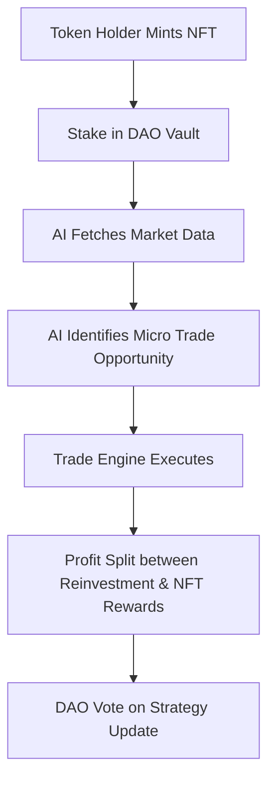
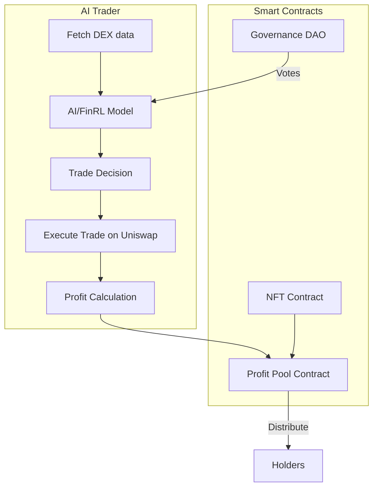
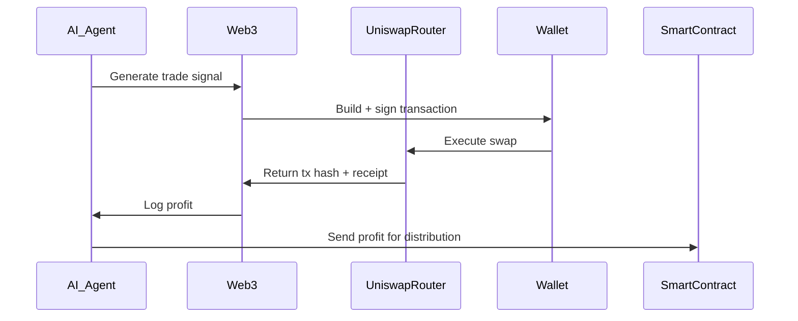
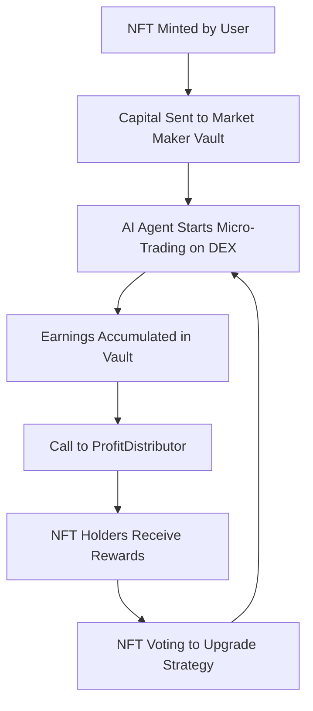

Identifying unexplored market anomalies with the potential to shape the future involves analyzing areas where traditional financial theories, such as the Efficient Market Hypothesis (EMH), may not fully explain observed market behaviors. These anomalies can present unique opportunities for investors and innovators. Here are some noteworthy areas:

**1. Financial Arbitrage Discrepancies**

Recent observations have highlighted significant mispricings in major markets, challenging the Law of One Price (LOOP). For instance, the market capitalization of Taiwan Semiconductor Manufacturing Co. (TSMC) has shown a 20% divergence between its listings in Taiwan and New York. Similarly, the cost of buying the S&P 500 through futures versus ETFs has revealed pricing dislocations, with futures presenting a much higher implied financing cost. These anomalies suggest a breakdown in traditional arbitrage mechanisms, potentially due to constraints in bank balance sheets that provide financing to arbitrageurs. This situation may offer opportunities for alternative financing solutions or innovative arbitrage strategies. citeturn0news10

**2. Adaptive Market Hypothesis (AMH) Applications**

The Adaptive Market Hypothesis proposes that market efficiency is dynamic and evolves based on participants' behaviors and environmental conditions. This perspective allows for the coexistence of traditional financial models with behavioral economics, suggesting that investors adapt to changing market conditions using heuristics. Understanding and identifying periods when markets transition between efficiency and inefficiency could unveil opportunities for strategic investments, especially in times of market stress or innovation. citeturn0search11

**3. Emerging and Frontier Markets Exploration**

Countries classified under groupings like CIVETS (Colombia, Indonesia, Vietnam, Egypt, Turkey, and South Africa) and frontier markets represent economies with rapid development and young, growing populations. These markets often exhibit inefficiencies due to lower liquidity and less analyst coverage, potentially leading to mispricings and opportunities for higher returns. Investing in these regions requires careful analysis of local conditions but can be rewarding due to their growth trajectories. citeturn0search17turn0search19

**4. Integration of Cryptocurrencies and Traditional Markets**

The dynamic relationship between cryptocurrencies and traditional stock markets, particularly in emerging economies, presents an area ripe for exploration. Studies have shown increasing interconnectedness between BRICS stock markets and cryptocurrencies during periods of high uncertainty, such as the COVID-19 pandemic. Understanding these spillover effects and the evolving role of digital assets could inform new investment strategies and financial products. citeturn0academia16

**5. Technological Innovations in Emerging Markets**

The rapid adoption of artificial intelligence (AI) and other technologies in emerging markets, such as Latin America, is creating new investment landscapes. AI-driven startups are addressing unique regional challenges, and evaluating the investment potential in these ventures involves assessing market size, growth prospects, and associated risks. Developing frameworks for valuing such startups can uncover opportunities in sectors previously overlooked by mainstream investors. citeturn0academia15

Exploring these areas requires a nuanced understanding of market dynamics, local contexts, and the interplay between traditional financial principles and evolving market behaviors. Engaging with these anomalies not only offers potential for substantial returns but also contributes to the development of more robust and inclusive financial systems. 

---
Using the above anomalies as a foundation, we can identify **viral opportunities** that go beyond traditional markets and have the potential to **reshape global technology, economy, and society**. These opportunities emerge at the **intersection of inefficiencies, behavioral shifts, and rapid technological adoption**, especially in underserved or evolving sectors:

---

### **1. AI-Powered Arbitrage-as-a-Service (AaaS)**
- **Inspired by:** Arbitrage Discrepancies & Financing Constraints
- **Opportunity:** Build decentralized AI platforms that identify and execute arbitrage opportunities across crypto, forex, and stock markets using peer-funded liquidity pools.
- **Tech Impact:** Enables retail participation in institutional-level trading; democratizes access to global markets.
- **Viral Potential:** "Earn passive income by funding real-time global arbitrage AI bots."

---

### **2. Frontier Market DAO Incubators**
- **Inspired by:** Frontier Markets & CIVETS inefficiencies
- **Opportunity:** Create DAO-based incubators to fund, mentor, and launch startups in high-growth, under-capitalized countries using stablecoins and tokenized equity.
- **Tech Impact:** Unlocks innovation in regions where traditional VC can’t reach.
- **Viral Potential:** "Invest in the next unicorn from Africa, Southeast Asia, or LATAM—before anyone else does."

---

### **3. Crypto-Native Stock Market for Emerging Markets**
- **Inspired by:** Integration of Crypto and Traditional Markets
- **Opportunity:** Build a decentralized stock exchange for emerging economies, where local businesses tokenize shares and trade via blockchain (including stablecoins or CBDCs).
- **Tech Impact:** Bridges capital gaps in unstable fiat economies; offers global access to local value.
- **Viral Potential:** "Buy shares in a booming African solar company with just $10 in crypto."

---

### **4. AI-Driven Adaptive Finance Apps (Behavioral Investing)**
- **Inspired by:** Adaptive Market Hypothesis
- **Opportunity:** Finance apps that adjust portfolio strategy based on behavioral signals, news sentiment, and user psychology using AI.
- **Tech Impact:** Hyper-personalized, behavior-reactive investing for every user.
- **Viral Potential:** "An app that learns your emotions—and invests better than you can."

---

### **5. Proof-of-Human-Effort (PoHE) Blockchain**
- **Inspired by:** Market Inefficiency + Tech Gaps
- **Opportunity:** A blockchain that validates blocks based on crowd-sourced human micro-tasks (transcription, validation, labeling), enabling job creation in low-income areas.
- **Tech Impact:** Replaces energy waste with human productivity while building ML/AI datasets.
- **Viral Potential:** "Mine crypto by solving real-world tasks from your phone."

---

### **6. AI x Cultural Marketplaces**
- **Inspired by:** Behavioral Gaps in Localized Content/Consumption
- **Opportunity:** Decentralized platforms that train and deploy AI models specific to regional languages, accents, fashion, and culture—for e-commerce, voice assistants, and entertainment.
- **Tech Impact:** Hyperlocal AI adoption + opens up untouched digital markets.
- **Viral Potential:** "An AI that speaks your language and sells your grandma’s recipes worldwide."

---

### **7. Cross-Border Salary & Gig Payments on Stablecoin Rails**
- **Inspired by:** Arbitrage & Cross-Market Dislocation
- **Opportunity:** A payment solution that allows employers to pay global freelancers in a stablecoin pegged to the *most favorable exchange rate* between local and global markets.
- **Tech Impact:** Creates real-time forex arbitrage + empowers global gig economy.
- **Viral Potential:** "Earn more for the same job—paid in your preferred stablecoin at the best rate."

---

### **8. Liquid NFTs for Frontier Infrastructure Projects**
- **Inspired by:** Funding Gaps in Frontier Markets
- **Opportunity:** Tokenize infrastructure projects (solar grids, water systems) as yield-generating NFTs with real-world revenue tied to their usage.
- **Tech Impact:** Brings DeFi to real-world impact; crowdfunding for civilization-building.
- **Viral Potential:** "Own a piece of a solar farm in Kenya—and earn monthly yield from villagers’ electricity bills."

---

### **9. Hybrid AI-Education Protocols in Developing Regions**
- **Inspired by:** AMH + Market Inefficiencies in Education
- **Opportunity:** Deploy adaptive AI-based learning using offline-first models and token incentives in rural areas, linked to global educational content.
- **Tech Impact:** AI as a bridge to education equality; incentivizes learning with crypto.
- **Viral Potential:** "Learn and earn: Blockchain-powered schooling for the unbanked."

---

### **10. Personal AI Hedge Fund via Tokenized Models**
- **Inspired by:** Adaptive Markets + AI Models in Emerging FinTech
- **Opportunity:** Tokenize AI investing models as NFTs where holders get a share of profits from algorithmic trades.
- **Tech Impact:** Individual creators can compete with institutions in finance using AI.
- **Viral Potential:** "Your AI just outperformed Wall Street—and it’s paying you for owning it."

---
Designing a **Decentralized AI-Powered NFT-Governed Market Maker (DAINMM)**. Step-by-step:

---

## 🔁 **Core Concept:**
A self-learning AMM agent that:
- Is **owned by NFT holders** (each NFT = 1 agent share/voting unit),
- Uses **real-time market data + AI models** to place **micro trades**,
- Dynamically **creates or breaks markets** based on the **proportional volume** it controls,
- **Returns profits** to NFT holders or reinvests via DAO votes.

---

## 🧠 **Core Features:**

### 1. **Agent Ownership via NFTs**
- Each NFT grants access to the AMM’s profit stream + governance rights.
- NFTs are tradeable and track **performance history** (past ROI, success rate).
- Optional: Dynamic NFT visuals showing real-time market share or earnings.

### 2. **AI Decision Layer**
- Aggregates CEX/DEX order book data, sentiment feeds, and token metrics.
- Predicts micro-opportunities (arbitrage, front-running, sandwich trades).
- Learns patterns in token behavior: volatility, volume spikes, liquidity shifts.
- Model Types: RL for trade execution, LSTM/CNN for market trend detection.

### 3. **Micro Trade Engine**
- Executes many small trades per block to influence market shape.
- Adjusts buy/sell walls to create or break markets around key price zones.
- Uses probabilistic volume control based on holding power vs. market cap.

### 4. **Volume-Weighted Influence System**
- Calculates: `v = (AMM-controlled volume) / (Total DEX volume)`
- Based on `v`, it adjusts aggressiveness:
  - **High v**: The AMM can "lead" the market (set price paths).
  - **Low v**: It follows trends passively for profit-taking.

---

## 🔄 **Workflow**



---

## 💰 **Profit Distribution Model**
- 60% to NFT holders (claimable or auto-compounded)
- 20% to strategy reinvestment
- 10% to AI infrastructure (costs & upgrades)
- 10% to DAO treasury for development grants

---

## 🛡️ **Safeguards**
- Circuit breaker: pauses trades during black swan events.
- Dynamic risk exposure management: adjusts liquidity across pools/tokens.
- Staking thresholds: only active stakers benefit from profit sharing.

---

## 🌐 **Launch Roadmap (MVP-first)**

| Phase | Milestone |
|-------|-----------|
| Phase 1 | Deploy MVP with 1 AI model and limited token pairs |
| Phase 2 | Launch NFT mint & DAO staking |
| Phase 3 | Integrate volume-aware trading behavior |
| Phase 4 | Add model marketplace (users submit AI models for fees/profit cut) |
| Phase 5 | Multi-chain AMM deployment + cross-chain arbitrage |

---
Absolutely. Let’s simulate the **core concept** of your **AI-Powered NFT-Governed Automatic Market Maker (AMM)** with a simplified flow and variables.

We'll break the simulation into:

---

## 🧠 **Simulation Setup**

### **Actors:**
- `NFT Holder`: Owns governance/voting rights and profit shares.
- `AMM Agent`: AI-driven trading system.
- `Market`: A volatile token market (Token X).

### **Key Variables:**
- `Total Market Volume (TMV)`: 1,000,000 Token X
- `AMM Controlled Volume (ACV)`: 100,000 Token X
- `Relative Volume Ratio (RVR) = ACV / TMV = 0.10 (10%)`
- `AI Signal Confidence`: 85%
- `AI Strategy`: Detects upcoming upward momentum.

---

## 🔁 **Step-by-Step Simulation**

### ✅ **Step 1: AI Observes Market Data**
- **Input:** Real-time order book, news sentiment, social volume
- **Output:** Signal → "Buy pressure increasing" (Confidence: 85%)

---

### ✅ **Step 2: AI Triggers Trade Plan**
- Based on confidence > threshold (80%), AI generates micro trade plan:
  - Trade 20% of controlled liquidity in **staggered buy orders**
  - Set up **sell wall** just above current price to guide price action.

---

### ✅ **Step 3: Market Behavior Simulation**
- Small buys increase Token X price by 1.5%
- AI’s trade wall prevents massive slippage
- Price hits sell wall → 70% of buys matched → 1.5% realized profit

---

### ✅ **Step 4: Profit and DAO Distribution**
- Net profit: 1.5% on 20,000 Token X = **300 Token X**
- Distribution:
  - 60% to NFT holders: 180 Token X
  - 20% reinvested: 60 Token X
  - 10% to AI model devs: 30 Token X
  - 10% to DAO treasury: 30 Token X

---

### ✅ **Step 5: DAO Vote Triggered**
- Proposal: "Shift 5% more volume to Token Y trading pair."
- NFT holders vote using weighted governance.
- If passed, AI updates portfolio allocation.

---

## 📈 **Visualization Summary**

| Stage              | Action                               | Result                        |
|--------------------|--------------------------------------|-------------------------------|
| AI Signal          | Detects uptrend                      | Confidence 85%                |
| Trade Execution    | Buys 20k tokens, sets sell wall      | 1.5% price rise               |
| Profit             | 300 Token X                          | Shared among stakeholders     |
| Governance         | Vote on strategy                     | Updates agent behavior        |

---

### 🧪 Simulation Insight:

> Even with **10% market share**, the AMM could **create micro-trends**, extract profits, and maintain market stability while **rewarding contributors** transparently.

---
```python
import numpy as np
import pandas as pd
import matplotlib.pyplot as plt
import seaborn as sns
from typing import List

# NFT holder setup
nft_holders = ["Alice", "Bob", "Charlie", "Diana"]
nft_weights = [0.4, 0.3, 0.2, 0.1]  # Percent ownership of AMM (sums to 1.0)

# Updated profit split function
def distribute_profits(total_profit: float, weights: List[float]) -> List[float]:
    return [round(total_profit * w, 2) for w in weights]

# Create simulation storage
holder_profits = {holder: [] for holder in nft_holders}
all_cycle_profits = []

# Reset price
price = initial_price
price_history = [price]

# Simulate with NFT holder profit distribution
for step in range(steps):
    confidence = ai_signal()
    price, profit = execute_micro_trade(price, confidence)
    price_history.append(price)
    all_cycle_profits.append(profit)

    # Distribute profits if profit > 0
    if profit > 0:
        distributed = distribute_profits(profit, nft_weights)
        for i, holder in enumerate(nft_holders):
            holder_profits[holder].append(distributed[i])
    else:
        for holder in nft_holders:
            holder_profits[holder].append(0)

# Create DataFrame for plotting
df = pd.DataFrame(holder_profits)
df['Cycle'] = range(1, steps + 1)
df.set_index('Cycle', inplace=True)

# Display total earnings
total_earnings = df.sum().to_frame(name="Total Profit")
total_earnings["% Share"] = [f"{w*100}%" for w in nft_weights]

import ace_tools as tools; tools.display_dataframe_to_user(name="NFT Holder Profit Distribution", dataframe=total_earnings)

# Plot NFT earnings per cycle
plt.figure(figsize=(10, 6))
sns.lineplot(data=df, marker='o')
plt.title("NFT Holder Profit Distribution per Cycle")
plt.xlabel("Cycle")
plt.ylabel("Profit in Token X")
plt.legend(title="NFT Holders")
plt.grid(True)
plt.tight_layout()
plt.show()

# Simulate two competing AMM agents with separate NFT holder groups

# Setup for AMM-A and AMM-B
amm_agents = {
    "AMM-A": {
        "volume": 100_000,
        "holders": ["Alice", "Bob"],
        "weights": [0.6, 0.4]
    },
    "AMM-B": {
        "volume": 80_000,
        "holders": ["Charlie", "Diana"],
        "weights": [0.7, 0.3]
    }
}

# Store results for both AMMs
all_price_history = {"Market Price": [initial_price]}
amm_profits = {name: [] for name in amm_agents}
holder_profits_all = {holder: [] for holder in sum([v['holders'] for v in amm_agents.values()], [])}

# Reset initial price
price = initial_price

# Run simulation
for step in range(steps):
    market_total_volume = sum([v["volume"] for v in amm_agents.values()])
    price_delta = 0

    for amm_name, amm_data in amm_agents.items():
        agent_volume = amm_data["volume"]
        confidence = ai_signal()
        if confidence > ai_confidence_threshold:
            trade_volume = 0.2 * agent_volume
            volume_ratio = agent_volume / market_total_volume
            price_impact = 0.015 * volume_ratio  # scaled by agent influence
            profit = trade_volume * price_impact * price
            price_delta += price_impact
            amm_profits[amm_name].append(profit)

            # Distribute profit among NFT holders
            distributed = distribute_profits(profit, amm_data["weights"])
            for i, holder in enumerate(amm_data["holders"]):
                holder_profits_all[holder].append(distributed[i])
        else:
            amm_profits[amm_name].append(0)
            for holder in amm_data["holders"]:
                holder_profits_all[holder].append(0)

    # Update price after both agents trade
    price = price * (1 + price_delta)
    all_price_history["Market Price"].append(price)

# Create DataFrame for price evolution
price_df = pd.DataFrame(all_price_history)
price_df['Cycle'] = range(0, steps + 1)
price_df.set_index('Cycle', inplace=True)

# Create final profit distribution
final_holder_df = pd.DataFrame(holder_profits_all)
final_holder_df['Cycle'] = range(1, steps + 1)
final_holder_df.set_index('Cycle', inplace=True)

# Summarize total earnings per holder
total_earnings_multi = final_holder_df.sum().to_frame(name="Total Profit")
total_earnings_multi["AMM Agent"] = ["AMM-A", "AMM-A", "AMM-B", "AMM-B"]

tools.display_dataframe_to_user(name="Multi-Agent NFT Holder Profits", dataframe=total_earnings_multi)

# Plot the market price evolution
plt.figure(figsize=(10, 5))
plt.plot(price_df, marker='o')
plt.title("Market Price Evolution With Competing AMM Agents")
plt.xlabel("Cycle")
plt.ylabel("Token X Price")
plt.grid(True)
plt.tight_layout()
plt.show()

# Simulate AI strategy upgrades and dynamic volume shifts based on past performance

# Add strategy performance modifier (AI strategy evolves every 3 cycles)
def get_strategy_multiplier(cycle):
    if cycle < 3:
        return 1.0  # Base AI
    elif cycle < 6:
        return 1.2  # Improved strategy
    else:
        return 1.5  # Advanced strategy

# Reset simulation storage
price = initial_price
price_history_evolved = [price]
holder_profits_evolved = {holder: [] for holder in holder_profits_all}
amm_profits_evolved = {name: [] for name in amm_agents}
market_total_volume = sum([v["volume"] for v in amm_agents.values()])

# Track dynamic volume reallocation (based on performance)
for step in range(steps):
    price_delta = 0
    amm_performance = {}

    for amm_name, amm_data in amm_agents.items():
        agent_volume = amm_data["volume"]
        confidence = ai_signal()
        multiplier = get_strategy_multiplier(step)

        if confidence > ai_confidence_threshold:
            trade_volume = 0.2 * agent_volume
            volume_ratio = agent_volume / market_total_volume
            price_impact = 0.015 * volume_ratio * multiplier
            profit = trade_volume * price_impact * price
            price_delta += price_impact
            amm_profits_evolved[amm_name].append(profit)
            amm_performance[amm_name] = profit

            # Distribute profits
            distributed = distribute_profits(profit, amm_data["weights"])
            for i, holder in enumerate(amm_data["holders"]):
                holder_profits_evolved[holder].append(distributed[i])
        else:
            amm_profits_evolved[amm_name].append(0)
            amm_performance[amm_name] = 0
            for holder in amm_data["holders"]:
                holder_profits_evolved[holder].append(0)

    # Update market price
    price *= (1 + price_delta)
    price_history_evolved.append(price)

    # DAO vote: Reallocate 10% volume from underperforming AMM to better performer
    if step % 3 == 2:
        if amm_performance["AMM-A"] > amm_performance["AMM-B"]:
            transfer_volume = 0.1 * amm_agents["AMM-B"]["volume"]
            amm_agents["AMM-B"]["volume"] -= transfer_volume
            amm_agents["AMM-A"]["volume"] += transfer_volume
        elif amm_performance["AMM-B"] > amm_performance["AMM-A"]:
            transfer_volume = 0.1 * amm_agents["AMM-A"]["volume"]
            amm_agents["AMM-A"]["volume"] -= transfer_volume
            amm_agents["AMM-B"]["volume"] += transfer_volume
        market_total_volume = sum([v["volume"] for v in amm_agents.values()])

# Final results
final_holder_df_evolved = pd.DataFrame(holder_profits_evolved)
final_holder_df_evolved['Cycle'] = range(1, steps + 1)
final_holder_df_evolved.set_index('Cycle', inplace=True)

# Total profit summary
total_evolved = final_holder_df_evolved.sum().to_frame(name="Total Profit with Strategy Upgrades")
total_evolved["AMM Agent"] = ["AMM-A", "AMM-A", "AMM-B", "AMM-B"]

tools.display_dataframe_to_user(name="Upgraded Strategy NFT Holder Profits", dataframe=total_evolved)

# Plot updated price evolution
plt.figure(figsize=(10, 5))
plt.plot(price_history_evolved, marker='o', label='Market Price')
plt.title("Market Price Evolution with AI Strategy Upgrades and DAO Liquidity Reallocation")
plt.xlabel("Cycle")
plt.ylabel("Token X Price")
plt.grid(True)
plt.legend()
plt.tight_layout()
plt.show()
```
---
To develop a Minimum Viable Product (MVP) for an AI-powered, NFT-governed Automatic Market Maker (AMM) with minimal code modifications, you can leverage existing open-source projects in decentralized finance (DeFi) and AI-driven trading. Here are some notable implementations to consider:

**1. Open-Source AMM Implementations:**

- **Uniswap Protocol:** Uniswap is a widely adopted decentralized exchange (DEX) protocol utilizing an AMM model. Its open-source code provides a robust foundation for creating AMMs.

- **Balancer:** Balancer is an AMM-based DEX that allows for flexible liquidity pools with multiple tokens and varying weights. Its open-source nature enables customization to suit specific project needs.

- **0xstepit/automated-market-maker:** This repository contains implementations of various bonding curve models underlying AMMs, offering insights into different mathematical approaches for automated trading. citeturn0search4

**2. AI-Powered Trading Frameworks:**

- **Hummingbot:** An open-source Python framework that assists in running automated trading strategies across centralized and decentralized exchanges. Hummingbot can be integrated with AI models to enhance trading decisions. citeturn0search18

- **FinRL:** A deep reinforcement learning framework designed to automate trading in quantitative finance. FinRL provides a full pipeline for developing AI agents capable of making trading decisions based on market data. citeturn0academia20

**3. NFT-Based Governance Protocols:**

- **OpenZeppelin Contracts:** A library for secure smart contract development, including modules for creating ERC-721 (NFT) tokens and governance mechanisms. Utilizing OpenZeppelin can streamline the implementation of NFT-based ownership and voting systems.

- **Aragon:** An open-source framework for creating decentralized autonomous organizations (DAOs). Aragon supports customizable governance structures, which can be integrated with NFT-based voting rights.

**Integration Strategy:**

- **AMM Core:** Start with the Uniswap or Balancer codebase to establish the fundamental AMM functionalities. These platforms offer well-tested smart contracts and can be extended to include additional features.

- **AI Integration:** Incorporate AI-driven trading strategies using Hummingbot or FinRL. These frameworks can interface with the AMM to execute trades based on predictive models and market analysis.

- **NFT Governance:** Implement NFT-based ownership and governance by leveraging OpenZeppelin's ERC-721 contracts and integrating them with Aragon's DAO framework. This setup enables token holders to participate in decision-making processes related to the AMM's operations.

**Considerations:**

- **Security:** Ensure all smart contracts are thoroughly audited and adhere to best practices to prevent vulnerabilities.

- **Compliance:** Stay informed about regulatory requirements related to DeFi, NFTs, and AI-driven trading in your jurisdiction.

- **Scalability:** Design the system to handle increased usage and transaction volumes as the platform grows.

By building upon these open-source projects, you can expedite the development of your MVP while minimizing the need for extensive coding from scratch. 

---
 **real-world MVP build plan** using **production-grade libraries** to bring your **AI-powered, NFT-governed AMM agent**.

---

## 🧠 **MVP Overview: AI-NFT-Governed AMM Agent**

Your MVP will:

✅ Use **AI (via FinRL or Hummingbot)** to detect profitable trades  
✅ Execute trades on a real **AMM (Uniswap v3 / Balancer)**  
✅ Reward **NFT holders (ERC-721)** proportionally from profits  
✅ Include **governance** and upgradeable AI logic (DAO-style)  

---

## ⚙️ **Tech Stack Selection**

| Component | Library/Tool |
|----------|----------------|
| Smart Contracts | [OpenZeppelin](https://github.com/OpenZeppelin/openzeppelin-contracts) |
| AMM Integration | [Uniswap v3 SDK](https://docs.uniswap.org/sdk/v3/overview) or [Balancer SDK](https://docs.balancer.fi/) |
| AI Agent | [FinRL](https://github.com/AI4Finance-Foundation/FinRL) or [Hummingbot](https://hummingbot.org/) |
| Web3 Integration | [web3.py](https://github.com/ethereum/web3.py) or [ethers.js](https://docs.ethers.org/) |
| API + Backend | Flask or FastAPI |
| Frontend | React + Tailwind (optional for dashboards) |
| NFT Management | ERC-721 with performance metadata |

---

## 🏗️ **MVP Build Plan**

### **Phase 1: Smart Contracts**

1. 🧱 **ERC-721 NFT Contract (Agent Ownership)**
   - Use OpenZeppelin to mint NFTs.
   - Track `shares` per NFT.
   - Emit events on transfers.

2. 📈 **Profit Distribution Contract**
   - Accepts trade profits.
   - Distributes to NFT holders based on their stake.

3. 🗳️ **Optional Governance (ERC-721 voting power)**
   - Use a lightweight DAO contract to allow AI strategy upgrades.

---

### **Phase 2: AI Trading Bot**

- **Option A:** Use [Hummingbot](https://hummingbot.org/) with your strategy.
- **Option B:** Use [FinRL](https://github.com/AI4Finance-Foundation/FinRL) for model training.

**Bot Logic:**
- Fetch real-time price & volume data from Uniswap/Balancer.
- Use FinRL model to decide “BUY / SELL / HOLD.”
- If trade → execute via AMM using private wallet & track profit.
- Send profit to smart contract.

---

### **Phase 3: Backend/API (Python Flask)**

- Connect AI logic + on-chain data.
- Expose endpoints:
  - `/nft/holders` → Show all current agents
  - `/trade/execute` → Trigger AI-based trade
  - `/profit/distribute` → Send profit to contract
  - `/market` → Real-time token stats
  - `/governance/proposal` → Submit vote for new strategy

---

### **Phase 4: Frontend (Optional)**

- Dashboard for:
  - NFT holder earnings
  - Strategy analytics
  - Trade history + AI decisions
  - Governance voting

---

## 🔁 Example Architecture Flow



---

## 🔧 Real Libraries to Install

```bash
# AI Agent
pip install finrl hummingbot

# Web3
pip install web3

# Flask API
pip install flask

# Smart Contract Dev
npm install --save-dev hardhat @openzeppelin/contracts ethers
```
Here’s a **detailed AI prompt** you can use to configure an MVP setup for your **AI-powered NFT-Governed AMM Agent**, **without a web console**. The app will run entirely via the **command line interface (CLI)** and integrate real components like **Uniswap, FinRL, and OpenZeppelin**.

---

## ✅ 🔧 Full Prompt to Build the Project:

---

### 🔤 **Prompt:**

> You are an advanced AI developer assistant. I want you to help me set up a real-world Minimum Viable Product (MVP) of an **AI-powered, NFT-governed Automatic Market Maker (AMM)** using real protocols and libraries.  
>
> ### 🧩 **System Components**:
>
> 1. **NFT Governance (ERC-721)**:
>    - Use OpenZeppelin contracts in Solidity to create a **mintable NFT**.
>    - Each NFT represents **a share of the AMM agent**.
>    - Store metadata to track share percent (optional: tokenURI with earnings).
>    - Reward holders by sending ETH or ERC20 profit proportionally.
>
> 2. **AI Trader (CLI tool)**:
>    - Create a CLI tool in **Python** using either **FinRL** or **Hummingbot**.
>    - Fetch token data from **Uniswap v3** using Web3 or The Graph.
>    - Apply basic strategy using Reinforcement Learning or simulated AI logic.
>    - On signal = BUY/SELL:
>      - Execute real trades (mock or testnet preferred first).
>      - Log profit and update local database.
>
> 3. **Profit Distributor CLI**:
>    - After each profitable trade:
>      - Send portion of profit to deployed **ProfitDistributor.sol** contract.
>      - Contract splits funds among all NFT holders proportionally.
>
> 4. **Governance Upgrade CLI**:
>    - Allow CLI-based creation of proposals (e.g. change model logic, increase capital).
>    - Proposals use NFT voting weight.
>    - Voting results should trigger external script or data change.
>
> ### ⚙️ **Setup Requirements**:
>
> - **Blockchain**: Ethereum Testnet (Sepolia or Goerli)
> - **Wallet**: Use `.env` with PRIVATE_KEY and RPC_URL
> - **DEX**: Uniswap v3 (interact via web3.py or Uniswap SDK)
> - **AI Agent**: Use FinRL to simulate at least one trained strategy.
> - **CLI-only Interface**: No frontend, only CLI-based execution.
> - **Data Storage**: Use SQLite or JSON files to store:
>   - Trade history
>   - NFT ownership
>   - Model configs
>
> ### 💡 **Sample CLI Commands**:
>
> - `python cli.py trade` → Run AI agent once and make a trade
> - `python cli.py distribute` → Distribute profit to NFT holders
> - `python cli.py earnings` → Show NFT earnings and shares
> - `python cli.py vote --proposal="upgrade AI"` → Start vote
> - `python cli.py proposal-status` → Show voting result
>
> ### 📦 Libraries To Use:
>
> - `web3.py` – Smart contract interaction
> - `FinRL` or `Hummingbot` – AI strategy logic
> - `click` or `argparse` – CLI parser
> - `dotenv` – Secrets management
> - `sqlite3` or `json` – Data storage
> - `OpenZeppelin Contracts` – NFT and DAO contracts
>
> ### 🔐 Security:
>
> - Load private key via `.env` only
> - All trade & fund transfers should be logged and require user confirmation
>
> ### 🧪 Testing:
>
> - Use Ganache CLI or Sepolia Testnet
> - Simulate a few trades, earnings, and distributions end-to-end

---

## 📁 Suggested Project Structure

```
amm-nft-ai-agent/
│
├── contracts/
│   ├── AMMTrader.sol
│   ├── ProfitDistributor.sol
│   └── AMMAgentNFT.sol
│
├── cli/
│   ├── cli.py
│   ├── trade.py
│   ├── distribute.py
│   └── governance.py
│
├── ai_agent/
│   └── strategy.py  # FinRL or Hummingbot strategy
│
├── data/
│   ├── nft_owners.json
│   ├── trade_history.json
│   └── config.json
│
├── .env
├── README.md
└── requirements.txt
```

**robust Web API layer** for an already-implemented AI trading agent (`ai_agent.py`). This API will expose your AMM agent’s functionality to external users, dApps, DAOs, or automated scripts via clean RESTful endpoints — **ideal for integration, monitoring, automation, and governance.**

---

### 🧠 ✅ AI Trader Web API Prompt

> You are an experienced backend and API architect. I have an AI trading agent already implemented inside a file named `ai_agent.py`. This file includes functions to:
>
> - Fetch token prices and volume data.
> - Run an AI model to decide trades (`BUY`, `SELL`, or `HOLD`).
> - Execute real or simulated trades using a Web3 wallet and Uniswap/Balancer.
> - Record trades and log profits.
>
> I want you to create a production-ready **REST API using Python FastAPI or Flask** to expose this agent to other systems.
>
> ### 🌐 **API Requirements**:
>
> #### ✅ Core Functional Endpoints:
>
> - `POST /trade/run`  
>   → Run the AI agent once, execute a trade (if signal allows), log the result.
>
> - `GET /trade/history`  
>   → Return a list of previous trades, including timestamp, action, volume, profit, token, and strategy used.
>
> - `GET /market/price?token=X`  
>   → Return the current price and volume for a given token.
>
> - `GET /strategy/status`  
>   → Return current AI model status, accuracy metrics, confidence, and current strategy name.
>
> - `POST /profit/distribute`  
>   → Trigger profit distribution to NFT holders (calls smart contract function).
>
> - `GET /holders/earnings`  
>   → Show all current NFT holders and their cumulative earnings.
>
> - `POST /governance/proposal`  
>   → Create a proposal to change strategy or rebalance volume.
>
> - `GET /governance/proposals`  
>   → Return list of active and past proposals, votes, and results.
>
> #### 🛡️ Security & Infra:
>
> - Load private key and wallet address from `.env` (using `python-dotenv`).
> - Use **logging + timestamped JSON logs** for every trade and proposal.
> - API auth using a simple token in headers (e.g. `x-api-key`)
> - CORS enabled for future frontend usage.
>
> #### 🧩 Bonus Features:
>
> - Add Swagger (OpenAPI) auto-doc generation
> - Create CLI test runner (`python test_cli.py`) to simulate a full AI trade + distribution + vote
> - Optional background task runner for auto-trading at intervals (`APScheduler` or `Celery`)
>
> ### 📦 Required Libraries:
>
> - `fastapi` or `flask`
> - `uvicorn` (if FastAPI)
> - `web3.py`
> - `python-dotenv`
> - `pydantic` (for request/response models)
> - `sqlite3` or `json` for storage (in-memory or file-based)
>
> ### 🧱 Architecture Goals:
>
> - Modular, decoupled components (`/services`, `/routes`, `/models`)
> - Clean interface for dApps, DAOs, wallets, and external bots to integrate
> - Expandable to plug-in new models, DEXs, or multi-chain logic
>
> Build a solid, scalable API foundation to control and observe the AI Trader in a decentralized trading ecosystem.

---
Here's a detailed breakdown of the **full trade sequence** from start to finish and how it **correlates to NFT ownership and reward distribution** in your AI-powered AMM protocol:

---

## **1. Initialization**

**What happens:**
- You deploy a smart contract that:
  - Mints **NFTs (ERC-721)** to token holders.
  - Sets ownership proportions (`shares`).
- Deploy the **ProfitDistributor** contract which can:
  - Accept funds (ETH or ERC20).
  - Distribute funds proportionally to NFT holders.

**Why this matters:**
- NFTs act as **access keys** and **reward shares** of the trading system.
- The system tracks which addresses should receive how much profit.

---

## **2. Market Observation (AI Monitoring)**

**Triggered by:**
- Manual call to `/trade/run` (or scheduled job)

**In code:**
```python
signal = ai_agent.get_trade_signal()
```

**What happens:**
- The AI agent gathers data (price, volume, volatility, sentiment).
- Evaluates whether a profitable trade opportunity exists.
- Confidence and strategy are returned (e.g., `BUY`, `HOLD`, `SELL`).

**Relation to NFT:**
- No direct interaction yet — the trade *decision* is agent-owned but its *benefit* is tied to NFT holders.

---

## **3. Trade Execution**

**Triggered if:** AI confidence is above threshold (e.g. 80%)

**In code:**
```python
result = ai_agent.execute_trade(token="WETH/USDC", action="BUY")
```

**What happens:**
- Trade executed on **Uniswap** via Web3 wallet.
- Profit is estimated after swap fees and gas.
- Trade result logged (profit, gas cost, timestamp, strategy).

**Relation to NFT:**
- Profit generated here is what will be later **distributed** to NFT holders.

---

## **4. Profit Logging**

**In code:**
```python
log_trade_to_file_or_db(result)
```

**What happens:**
- Trade history saved to JSON/DB with:
  - Action, token, timestamp
  - Profit
  - Strategy used
  - Gas cost

**Why it matters:**
- Enables transparency and auditability.
- Can be linked to NFT metadata or dashboards.

---

## **5. Profit Distribution**

**Triggered by:**
- Call to `/profit/distribute`
- Or automatically post-trade (optional config)

**In code:**
```python
web3_contract.functions.distributeProfits().transact({"from": bot_wallet, "value": profit})
```

**What happens:**
- Profit sent to `ProfitDistributor.sol` smart contract.
- Contract checks **current NFT holders**.
- Distributes ETH/ERC20 proportionally based on NFT shares.

**Example:**
If:
- Profit = 100 DAI
- NFT_Alice = 40%, NFT_Bob = 30%, NFT_Charlie = 20%, NFT_Diana = 10%

Then:
- Alice gets 40 DAI, Bob 30, etc.

**Relation to NFT:**
- The **ownership** of NFT is the basis for getting real monetary returns.
- It acts as a **permissionless, on-chain dividend claim**.

---

## **6. Earnings Accumulation & Withdrawal**

**What happens:**
- NFT holders call:
```solidity
ProfitDistributor.claimEarnings()
```
- Or use Web API:
```bash
curl http://localhost:8000/holders/earnings
```

They can:
- Claim their share of profits (ETH/ERC20 sent to wallet)
- Track cumulative earnings in dashboards

---

## **7. Optional DAO/Governance**

**NFT-based governance:**
- NFT holders vote on proposals (e.g. upgrade AI model, change trading token, rebalance portfolio).
- Votes are weighted by NFT shares.
- On success, AI agent or smart contract logic is modified.

---

## **Summary Sequence:**

| Step | Action | Linked To NFT |
|------|--------|----------------|
| 1 | AI evaluates market | No |
| 2 | AI executes trade | No |
| 3 | Logs trade & calculates profit | Not yet |
| 4 | Sends profit to contract | Yes |
| 5 | Smart contract splits profit | Yes — based on NFT shares |
| 6 | NFT holders claim earnings | Yes — NFT acts like a “dividend pass” |
| 7 | Proposals change strategies | Yes — NFT = governance power |

---
Great question — let’s break down **exactly how the trade executes** in your AI-powered AMM system, step by step, using real-world tools like **Uniswap v3**, **Web3**, and your **AI agent**.

---

## **Core Components Involved in Trade Execution**

| Component | Role |
|----------|------|
| `ai_agent.py` | Makes the decision (BUY/SELL) |
| `wallet (private key)` | Signs and sends the transaction |
| `Uniswap SDK / Router contract` | Executes the swap |
| `Web3.py or ethers.js` | Interface for sending the trade |
| `ETH or ERC20 balance` | Funds the trade & pays gas |

---

## **Step-by-Step Execution Flow**

### **1. AI Agent Decision**

Your AI agent (e.g., FinRL model) determines the trade action.

```python
signal = ai_agent.get_trade_signal()
# returns: {'action': 'BUY', 'confidence': 0.86, 'token': 'WETH/USDC'}
```

This decision is based on:
- Price trends
- Volume
- Volatility
- Sentiment data (optional)

---

### **2. Define the Trade Details**

Let’s say your bot is trading WETH for USDC on **Uniswap v3**.

```python
token_in = "0xC02aaa39b223FE8D0a0e5C4F27eAD9083C756Cc2"  # WETH
token_out = "0xA0b86991c6218b36c1d19D4a2e9Eb0cE3606eB48"  # USDC
amount_in_wei = web3.toWei(0.1, 'ether')
```

---

### **3. Build Transaction**

You can use:
- **Uniswap v3 Router Contract (exactInputSingle)**
- Or, use **Uniswap v3 SDK (Python or JS)** to build the calldata.

```python
router = web3.eth.contract(address=UNISWAP_ROUTER, abi=UNISWAP_ABI)

tx = router.functions.exactInputSingle({
    'tokenIn': token_in,
    'tokenOut': token_out,
    'fee': 3000,
    'recipient': wallet_address,
    'deadline': int(time.time()) + 60,
    'amountIn': amount_in_wei,
    'amountOutMinimum': 0,
    'sqrtPriceLimitX96': 0
}).buildTransaction({
    'from': wallet_address,
    'gas': 300000,
    'gasPrice': web3.eth.gas_price,
    'nonce': web3.eth.get_transaction_count(wallet_address),
    'value': amount_in_wei
})
```

---

### **4. Sign & Send**

Use the private key (loaded from `.env`) to sign and send the transaction:

```python
signed_tx = web3.eth.account.sign_transaction(tx, private_key=PRIVATE_KEY)
tx_hash = web3.eth.send_raw_transaction(signed_tx.rawTransaction)
receipt = web3.eth.wait_for_transaction_receipt(tx_hash)
```

---

### **5. Record Profit and Outcome**

After the trade executes, calculate:

```python
profit = amountOutUSDC - gasCost - (previous USDC balance)
```

Then log it:
```json
{
  "txHash": "0xabc...",
  "token": "WETH/USDC",
  "action": "BUY",
  "profit": "18.41 USDC",
  "timestamp": "2025-03-25T14:22Z"
}
```

---

### **6. Optional Post-Trade Actions**
- Call `ProfitDistributor.sol` to send profits to NFT holders
- Update strategy logs
- Trigger next AI evaluation

---

## **Visual Summary Flow**



---

## ✅ Real Tools You Can Use

| Tool | Use |
|------|-----|
| `web3.py` | Build, sign, and send tx |
| `Uniswap v3 SDK` | Price estimation and calldata |
| `ETH Testnet` | Deploy and test without risk |
| `dotenv` | Securely load wallet private key |
| `SQLite/JSON` | Track trade and profit logs |

---
**decentralized agent-owned market maker**, where the NFTs themselves are **investment receipts** and **governance tokens**, and the **NFT mint proceeds become the agent’s liquidity**. This is a powerful structure — let me break it down for you:

---

## **Agent-Governed Market Maker Using NFT Funds: How It Works**

---

### **Step 1: NFTs = Shares + Capital Contribution**

- Each NFT is minted for a price (say 1 ETH).
- The mint price directly funds the **Market Making Vault**.
- This pool of funds is the **liquidity capital** used by the AI agent.
- Each NFT represents:
  - A **governance share** (voting rights),
  - A **reward share** (proportional to capital provided).

> Example:
> - 100 NFTs minted at 1 ETH = 100 ETH liquidity pool.
> - Each NFT = 1% voting + 1% earnings.

---

### **Step 2: AI Agent = Market Maker Using NFT Capital**

- The **agent uses the pool** to run **market-making strategies**, such as:
  - Quoting tight **bid-ask spreads** on Uniswap v3.
  - Earning fees from swaps.
  - Running **liquidity sandwiching**, **arbitrage**, or **rebalancing** trades.
- Micro trades ensure:
  - **Continuous exposure** to token pairs,
  - **Profit from volatility**, not speculation.

> Example strategy:
> - Provide liquidity on WETH/DAI in Uniswap v3 with 0.3% spread
> - Every trade earns 0.3% of volume as fees
> - AI adjusts ranges every few blocks

---

### **Step 3: Profit Accumulation**

- Profits are tracked:
  - As **realized earnings** (e.g. swap fees earned),
  - Or **unrealized NAV increase**.
- AI logs earnings and trade history.
- Profit is stored in stablecoin or split across strategy buckets.

---

### **Step 4: Proportional Distribution via Governance**

- After each cycle (daily/weekly):
  - Profits are sent to `ProfitDistributor.sol`.
  - Smart contract checks **NFT metadata** (or internal ledger).
  - Proportionally distributes rewards.

> Example:
> - NFT #1 has 2.5% share.
> - If 10 ETH profit this cycle → gets 0.25 ETH.

---

### **Step 5: Governance Over Strategy & Treasury**

NFT holders can **vote** on:

- Changing strategy (e.g. from passive LP to active scalping).
- Adjusting token pair weights.
- Withdrawing funds or allocating to R&D.
- Upgrading the AI agent’s model or risk config.

> Smart contracts can enforce vote results or require **multisig DAO execution**.

---

## **Full System Flow**



---

## **How to Implement This**

### 1. **Smart Contracts**
- `NFTGovernedAgent.sol`:
  - Tracks NFT shares.
  - Accepts governance proposals.
- `MarketMakerVault.sol`:
  - Holds pooled funds.
  - Only AI bot address can trade.
- `ProfitDistributor.sol`:
  - Splits funds to NFT holders.

### 2. **AI Trading Agent**
- Fetches wallet balance from `MarketMakerVault`.
- Places quotes, updates liquidity positions.
- Calculates profit, sends to `ProfitDistributor`.

### 3. **Governance Voting**
- Uses NFT-based weighted voting.
- Store votes off-chain (snapshot) or on-chain (ERC-721 DAO logic).
- Winning vote updates AI config or triggers strategy swap.

---

## **Benefits of This Design**

| Feature | Benefit |
|--------|---------|
| NFTs as entry + ownership | Easy UX, composable, tradable |
| AI-powered market making | Autonomy + data-driven strategy |
| Micro-trade approach | Steady profit, low volatility |
| Real yield to NFT holders | Passive income from real markets |
| Governance | Community-controlled evolution |

---
## 🧠 **1. Who Owns the Trade Engine?**

> The **Trade Engine is owned by the Agent** — but the **Agent is governed by the NFT holders**.

### 🎯 Let’s define this clearly:

| Entity | Role | Ownership |
|--------|------|-----------|
| **NFT Holders** | Fund and govern the agent | Each NFT = % ownership + voting rights |
| **AI Agent** | Logic that generates trades & manages funds | Controlled by NFT governance |
| **Trade Engine** | Executes the AI’s decisions on-chain | Owned by the Agent (or Agent Vault contract) |

So the **agent owns the engine**, and **NFT holders own the agent**.

---

## 🔗 **2. How is the Trade Engine Connected to the Agent?**

Here’s how this relationship works, layer by layer:

### ⚙️ Architectural Layers:

```mermaid
graph TD
  A[NFT Holder] --> B[NFT Contract (Governance)]
  B --> C[AI Agent Config & Vault Access]
  C --> D[Trade Engine / Liquidity Manager]
  D --> E[DEX (Uniswap/Balancer)]
```

---

### 💡 Component Breakdown

#### 🔹 A. **NFT Contract**
- NFT mint proceeds fund the vault.
- Stores ownership data.
- May include governance logic (or interact with DAO contract).

#### 🔹 B. **AI Agent**
- A backend service or on-chain module:
  - Reads market data.
  - Decides on actions (buy/sell/add liquidity).
  - Operates based on a configuration file or on-chain DAO parameters.
- Governed by votes from NFT holders.

#### 🔹 C. **Trade Engine**
- A **service** or **contract** that:
  - Executes the orders created by the agent.
  - Manages position sizing, gas fees, slippage.
- Can be fully on-chain (via smart contracts), or hybrid (AI logic off-chain, engine on-chain).

> 🔐 Access to Trade Engine is **only granted to the agent** (enforced via wallet or contract permissions).

---

## ✅ Realistic Architecture for MVP

| Layer | Tech |
|-------|------|
| **Governance** | OpenZeppelin ERC-721 + DAO framework |
| **AI Agent** | Python (FinRL or Hummingbot strategy) |
| **Trade Engine** | Python Web3 scripts + Smart Contracts (Vault + Router) |
| **Execution** | Uniswap v3 or Balancer |
| **Distribution** | ProfitDistributor smart contract |

---

## 📦 Trade Flow Sequence

1. **User mints NFTs** → funds added to vault.
2. **Agent config** is set by NFT governance (e.g. trade WETH/USDC).
3. **AI Agent** (Python process) runs every X minutes:
   - Scans data.
   - Generates trade signal.
4. **Trade Engine** receives the signal:
   - Builds tx using Web3.
   - Executes trade on Uniswap.
   - Logs tx + profit.
5. **Profit** is periodically sent to ProfitDistributor.
6. **NFT holders** claim earnings via smart contract.

---

## 🔐 Security Tips

- Keep the Trade Engine address **controlled by multisig or timelocked upgrades**.
- Store AI model parameters **off-chain**, but commit hash on-chain for verifiability.
- Allow **emergency shutdown** via DAO vote if exploit detected.

---
Address the **technical risks** in your AI-powered, NFT-governed AMM system.

---

## ⚙️ **1. On-Chain / Off-Chain Syncing**

### 🔥 Problem:
Your AI agent makes off-chain decisions (Python), but funds are on-chain. If you lose sync, it could trade with stale data or in conflict with governance.

### ✅ Solution:
- **State checkpointing:** Store each decision hash and result in a local database, and **periodically commit it on-chain** (via `keccak256(hash)`).
- **Heartbeat Mechanism:** A `last_updated_block` timestamp is kept on-chain to validate freshness before trade.
- **Watchdog Service:** Run a process that ensures AI → tx → confirmation → log cycle is complete, otherwise trigger fallback.

---

## ⚙️ **2. Trade Engine Safety**

### 🔥 Problem:
Your trade engine executes real trades with pooled funds. A bad trade or bug can drain capital.

### ✅ Solution:
- **Trade Threshold Limits:**
  - Max % of vault used per trade (e.g. 1–2%).
  - Per-token and per-minute trade frequency limits.
- **Transaction Simulator:**
  - Simulate the expected profit and slippage pre-trade.
- **Safe Mode / Circuit Breaker:**
  - If more than X% loss in 24h, pause the agent.
- **Multisig Override:**
  - Allow DAO or dev team to manually halt the trade engine.

---

## ⚙️ **3. NFT Metadata & State Tracking**

### 🔥 Problem:
Tracking each NFT’s share, rewards, and votes on-chain is expensive and complex.

### ✅ Solution:
- Use **off-chain indexer** (e.g., The Graph or SQLite with sync jobs) to track:
  - NFT holder addresses
  - Earned profit per cycle
- Then update **on-chain merkle root** or **reward claims** per NFT once per epoch.
- Use `claimableRewards(nftID)` function on-chain instead of updating every time.

---

## ⚙️ **4. Model Drift & AI Failures**

### 🔥 Problem:
AI models degrade in performance over time if not retrained or monitored.

### ✅ Solution:
- **Live Performance Monitoring:**
  - Track actual vs expected PnL per trade.
  - Alert if variance exceeds threshold.
- **Model Registry:**
  - Store models with versioning and confidence metrics.
  - Allow voting to upgrade to a new model.
- **Backtesting Pipeline:**
  - Weekly retrain on new data, simulate before deploying.
- **Shadow Deployment:**
  - Run the new model in parallel and compare outcomes before replacing the old one.

---

## ⚙️ **5. Market Saturation & Slippage**

### 🔥 Problem:
If your agent trades too much or too visibly, you’ll get front-run or incur slippage.

### ✅ Solution:
- **Trade Randomization:**
  - Vary trade size and time slightly to prevent pattern detection.
- **Private Order Protocols:**
  - Integrate with **Flashbots** or **Cowswap** to avoid public mempool.
- **Spread Management:**
  - Dynamically widen spreads in low-liquidity situations.

---

## ⚙️ **6. Gas Efficiency**

### 🔥 Problem:
Frequent micro-trades and NFT reward distributions can burn ETH in gas.

### ✅ Solution:
- **Batching Transactions:**
  - Bundle reward distribution into one contract call.
- **On-chain State Compression:**
  - Use Merkle trees or bitmap storage for reward state.
- **L2 Deployment:**
  - Deploy the whole system on **Optimism, Arbitrum, or Base** to slash gas fees by 90%.

---

## 🧠 **Additional Tools to Help**

| Tool | Purpose |
|------|---------|
| 🧪 **Tenderly** | Simulate & monitor on-chain txs with rollback previews |
| 🕵️ **Slither** | Analyze smart contracts for vulnerabilities |
| 🛠️ **Hardhat** | Automate test scripts with forked mainnet |
| 🔁 **The Graph** | Index NFTs and reward history efficiently |
| 📡 **APScheduler or Celery** | Orchestrate off-chain AI + trade loops with retry logic |

---
Integrating components from [**Freqtrade**](https://github.com/freqtrade/freqtrade) , a free and open-source crypto trading bot written in Python, can significantly accelerate the development of your AI-powered, NFT-governed Automated Market Maker (AMM) MVP. Here's how Freqtrade's features align with your project's requirements:

**1. Trading Engine:**
- **Order Execution:** Freqtrade supports major cryptocurrency exchanges, facilitating seamless order placements and executions.
- **Strategy Implementation:** It allows for the development and integration of custom trading strategies, enabling the AI agent to execute micro-trades effectively.

**2. AI Integration (FreqAI Module):**
- **Machine Learning Models:** Freqtrade's FreqAI module supports the integration of machine learning models for market prediction and strategy optimization.
- **Adaptive Learning:** The system can retrain models during live deployments, allowing the AI agent to adapt to changing market conditions.

**3. Backtesting and Simulation:**
- **Historical Data Analysis:** Freqtrade provides tools for backtesting strategies against historical data, enabling the evaluation of performance before live deployment.
- **Simulation Environment:** It offers a simulation mode to test strategies in a controlled environment, reducing the risk of unforeseen issues during live trading.

**4. Extensibility and Customization:**
- **Plugin System:** Freqtrade's modular architecture allows for the addition of custom plugins, which can be utilized to integrate NFT-based governance and profit distribution mechanisms.
- **API Access:** It offers API endpoints that can be leveraged to connect with external systems, such as smart contracts managing NFTs.

**Considerations for Integration:**
- **NFT Governance Integration:** While Freqtrade provides a robust trading framework, integrating NFT-based governance will require additional development to connect the trading engine with smart contracts that manage NFT ownership and profit distribution.
- **Customization Effort:** Adapting Freqtrade to fully align with the unique aspects of your MVP, such as NFT-based fund pooling and governance, will necessitate significant customization.

In summary, Freqtrade offers a solid foundation for the trading and AI components of your MVP. However, integrating NFT governance and fund distribution will require additional development to bridge the gap between Freqtrade's capabilities and your project's specific needs. 

---
Integrating components from the [NFT-Incentivized-Crypto-Crowdfunding](https://github.com/dvoronkov/NFT-Incentivized-Crypto-Crowdfunding) project can effectively address specific gaps in your AI-powered, NFT-governed Automated Market Maker (AMM) MVP:

**1. NFT Incentivization Mechanism:**
   - **Implementation:** The project employs Solidity smart contracts to distribute NFTs as incentives to contributors. This mechanism can be adapted to reward users who provide liquidity or participate in governance within your AMM platform.
   - **Benefit:** Enhances user engagement by offering unique NFTs as rewards, fostering a sense of ownership and participation.

**2. Smart Contract Architecture:**
   - **Implementation:** The project's smart contracts manage the receipt of contributions and the minting of NFTs. These contracts can serve as a foundation for developing contracts that handle fund pooling, trade execution, and profit distribution in your MVP.
   - **Benefit:** Provides a tested framework for managing on-chain transactions and interactions, ensuring reliability and security.

**3. Frontend Integration:**
   - **Implementation:** Utilizes Streamlit to create a user-friendly interface for deploying contracts and making contributions. This approach can be employed to develop intuitive dashboards for users to interact with the AMM, monitor performance, and participate in governance.
   - **Benefit:** Improves user experience by providing accessible and straightforward interfaces for complex blockchain interactions.

**4. NFT Generation and Management:**
   - **Implementation:** Incorporates the Moralis Mutant NFT Engine to generate unique NFT images for contributors. This system can be leveraged to create and manage NFTs that represent governance rights or shares in the AMM's profits.
   - **Benefit:** Facilitates the creation of distinctive NFTs that can symbolize user stakes or achievements within the platform.

**Considerations for Integration:**
   - **Customization:** While the existing components provide a solid foundation, they will require customization to align with the specific functionalities and goals of your AMM MVP.
   - **Security Audits:** Conduct thorough security audits of the integrated smart contracts to ensure the safety of user funds and platform integrity.
   - **Scalability:** Assess and optimize the performance of the smart contracts and frontend components to handle the anticipated user load and transaction volume.

By incorporating these elements, your MVP can effectively utilize NFTs for incentivization and governance, enhancing user engagement and creating a robust, decentralized trading platform. 
